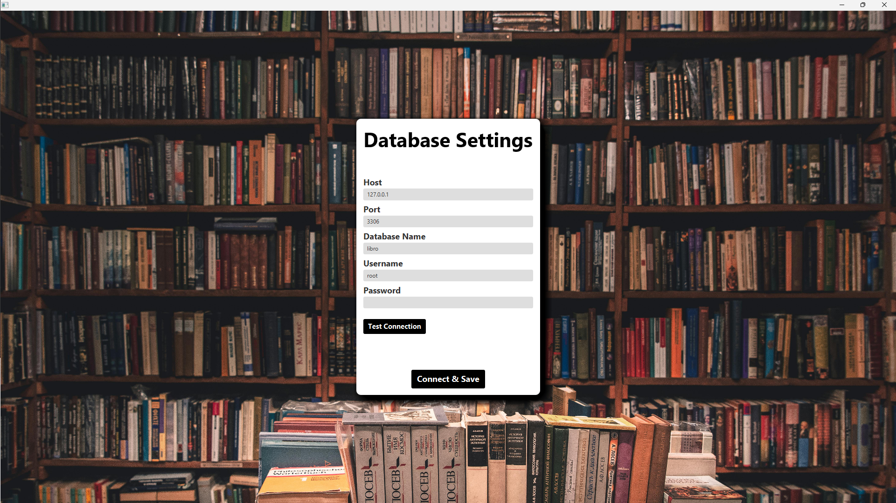

# Libro: Open Source Library Management App - Currently Under Development

## Welcome to Libro, the ultimate open-source solution for managing your library with ease and efficiency. Libro is designed to streamline the organization, tracking, and lending processes for libraries of all sizes. Whether you're managing a small community library or a large institutional collection, Libro has the tools you need to keep everything running smoothly.

## Built with JavaFX

### Libro is developed using JavaFX, a powerful and versatile framework for building modern, visually appealing, and responsive desktop applications. JavaFX provides a rich set of UI controls and CSS styling options, enabling us to create an intuitive and user-friendly interface for managing your library. With JavaFX, Libro ensures a seamless and engaging experience for both administrators and library members.

## Features

* ### Admin login

* ### Secure database connection

* ### Track books inventory
* ### Make book reservations
* ### Return date calculation
* ### Fine calculation for overdue books
* ### Add new members to the library
* ### Add new books to the collection
* ### Notifications and reminders for due dates and reservations
* ### Detailed borrowing history and analytics
* ### Barcode scanning for book check-in and check-out
* ### Integration with digital catalogs and e-books
* ### Import and export data functionality

## Database Schema

### Table: `users`

id, username, password, role

|Column | 	Data Type  | Constraints           | Description          |
| ------------- |-------------|-----------------------|----------------------|
| id  | INT         | PRIMARY KEY, NOT NULL | Auto generated ID    |
| username  | VARCHAR(45) |        NOT NULL               | Username of the user |
|      password     |       VARCHAR(45)      |        NOT NULL               | Password of the user |
|         role          |    VARCHAR(45)         |       NOT NULL                | Role of the user     |